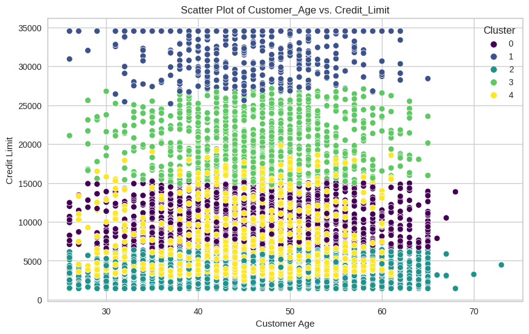

# Laporan Proyek UAS Machine Learning 

<table>
<tr>
<td>Nama</td>
<td>:</td>
<td>Nita Andriani</td>
</tr>
<tr>
<td>NIM</td>
<td>:</td>
<td>211351104</td>
</tr>
<tr>
<td>Kelas</td>
<td>:</td>
<td>Informatika Malam B</td>
</tr>
</table>

## Domain Proyek


Dalam proyek ini, kita akan mengeksplorasi dataset nasabah kartu kredit dan menggunakan metode pengelompokan untuk mengelompokkan nasabah berdasarkan karakteristik mereka, Dengan menggunakan kecanggihan algoritma pengelompokan, proyek ini bertujuan untuk mengungkap wawasan yang dapat membantu perusahaan kartu kredit memahami lebih baik nasabah mereka dan merancang strategi efektif untuk mempertahankan para nasabahnya. So, Let's dive in !

## Business Understanding

 Informasi yang ditemukan dalam proyek ini dapat menjadi landasan bagi perusahaan kartu kredit untuk mengidentifikasi langkah-langkah proaktif dalam mempertahankan pelanggan, meningkatkan kepuasan, dan mengoptimalkan kinerja bisnis.

Bagian laporan ini mencakup:

### Problem Statements

- Bagaimana kita dapat menciptakan solusi yang dapat mengidentifikasi segmen nasabah yang berbeda?
- Bagaimana cara pengembangan strategi pemasaran yang sesuai dengan segmen nasabah?

### Goals

Mengembangkan model segmentasi pelanggan yang dapat mengidentifikasi dan memahami dengan jelas perbedaan antara segmen pelanggan yang berbeda.

### Solution statements

Menggunakan K-Means untuk melakukan analisis cluster yang mendalam terhadap karakteristik nasabah, memungkinkan identifikasi preferensi dan perilaku unik di setiap segmen.


## Data Understanding

Dataset yang saya gunakan bersumber dari Kaggle yang berjudul Predicting Credit Card Customer Segmentation yang berisi banyak informasi nasabah yang dikumpulkan dari dalam portofolio kartu kredit konsumen, dengan tujuan membantu analis memprediksi pengurangan nasabah.

Adapun Dataset yang saya gunakan, bisa di akses melalui 
 [Kaggle : Predicting Credit Card Customer Segmentation](https://www.kaggle.com/datasets/thedevastator/predicting-credit-card-customer-attrition-with-m/data). 

Berikut informasi pada dataset:

- Dataset memiliki format CSV (Comma-Separated Values).
- Dataset memiliki 10.127 records data dengan 23 kolom.


### Variabel-variabel pada FPredicting Credit Card Customer Segmentation adalah sebagai berikut:

1. **CLIENTNUM:** Identifikasi untuk setiap nasabah. [int64] <br>
2. **Attrition_Flag:** Penanda yang digunakan untuk membedakan nasabah yang masih ada dan tidak. [object] <br>
3. **Customer_Age:** Usia Nasabah. [int64] <br>
4. **Gender:** Jenis kelamin Nasabah. [object] <br>
5. **Dependent_count:** Jumlah tanggungan yang dimiliki nasabah [int64] <br>
6. **Education_Level:** Tingkat Pendidikan Nasabah. [object] <br>
7. **Marital_Status:** Status perkawinan nasabah. [object] <br>
8. **Income_Category:** Kategori pendapatan nasabah. [object] <br>
9. **Card_Category:** Jenis kartu yang dimiliki nasabah. [object] <br>
10. **Total_Relationship_Count:** Jumlah total hubungan yang dimiliki pelanggan dengan penyedia kartu kredit [int64]  <br>
11. **Months_on_book:** Total waktu berapa lama menjadi nasabah. [int64] <br>
12. **Months_Inactive_12_mon:** Jumlah bulan nasabah tidak aktif dalam dua belas bulan terakhir. [int64] <br>
13. **Contacts_Count_12_mon:** Jumlah kontak yang dimiliki nasabah dalam dua belas bulan terakhir. [int64] <br>
14. **Credit_Limit:** Batas kredit nasabah. [float64] <br>
15. **Total_Revolving_Bal:** saldo bergulir nasabah. [int64] <br>
16. **Avg_Open_To_Buy:** Rata-rata rasio terbuka untuk pembelian nasabah. [float64] <br>
17. **Total_Amt_Chng_Q4_Q1:** Jumlah total berubah dari kuartal 4 ke kuartal 1. [float64] <br>
18. **Total_Trans_Amt:** Jumlah Transaksi. [int64] <br>
19. **Total_Trans_Ct:** Total Jumlah Transaksi. [int64] <br>
20. **Total_Ct_Chng_Q4_Q1:** Jumlah total berubah dari kuartal 4 ke kuartal 1. [float64] <br>
21. **Avg_Utilization_Ratio:** Rasio pemanfaatan rata-rata nasabah. [float64] <br>
22. **Naive_Bayes_Classifier_Attrition_Flag_Card_Category_Contacts_Count_12_mon_Dependent_count_Education_Level_Months_Inactive_12_mon_1:** Pengklasifikasi Naive Bayes untuk memprediksi apakah seseorang akan churn atau tidak berdasarkan karakteristik seperti yang ada.1 [float64] <br>
23. **Naive_Bayes_Classifier_Attrition_Flag_Card_Category_Contacts_Count_12_mon_Dependent_count_Education_Level_Months_Inactive_12_mon_2:**  Pengklasifikasi Naive Bayes untuk memprediksi apakah seseorang akan churn atau tidak berdasarkan karakteristik seperti yang ada.2 [float64] <br>

## Data Discovery
Berikut merupakan tahapan dari Data Discovery yang saya lakukan: 

Mengunggah Token API Kaggle agar dapat mengunduh dataset yang ada di Kaggle.

```
from google.colab import files
files.upload()
```
Membuat Direktori untuk token kaggle.
```
!mkdir -p ~/.kaggle
!cp kaggle.json ~/.kaggle/
!chmod 600 ~/.kaggle/kaggle.json
!ls ~/.kaggle
```
Mengunduh dataset yang ada di Kaggle.
```
!kaggle datasets download -d thedevastator/predicting-credit-card-customer-attrition-with-m
```
Membuat direktori untuk dataset lalu mengekstrak dataset yang sudah di unduh sebelumnya.
```
!mkdir predicting-credit-card-customer-attrition-with-m
!unzip predicting-credit-card-customer-attrition-with-m.zip -d predicting-credit-card-customer-attrition-with-m
!ls predicting-credit-card-customer-attrition-with-m
```
Mengimport library-library yang akan digunakan dalam proyek.
```
import numpy as np
import pandas as pd
import matplotlib.pyplot as plt
import seaborn as sns
from sklearn.preprocessing import LabelEncoder
from sklearn.cluster import KMeans
from sklearn.preprocessing import StandardScaler
from yellowbrick.cluster import KElbowVisualizer
from sklearn.metrics import silhouette_score
import warnings
warnings.filterwarnings("ignore")
```
Membaca file .csv yang ada dalam dataset dari kaggle menjadi dataframe (df).
```
df = pd.read_csv('predicting-credit-card-customer-attrition-with-m/BankChurners.csv')
```
Untuk memastikan dataset sudah terbaca, dilakukan dataset.head() untuk melihat 5 teratas dari dataframe.
```
df.head()
```
Setelah itu, kita perlu memeriksa informasi umum dari dataset yang kita gunakan guna mengetahui tipe data apa saja yang ada dalam dataset kita.

```
df.info()
```


Selanjutnya, saya perlu mengetahui informasi mengenai statistik deskriptif dari dataframe. 
```
df.describe()
```


Memeriksa apakah ada data yang bernilai null atau tidak

```
df.isnull().sum()
```

Memeriksa apakah ada duplicate data atau tidak

```
df_duplicated = df[df.duplicated()]
df_duplicated.shape[0]
```
Dalam data discovery, Saya melakukan Teknik **Exploratory Data Analysis (EDA)**.
Proses EDA dilakukan dengan menganalisis dataset untuk mendapatkan pemahaman yang utuh mengenai dataset guna mendapatkan insight & knowledge.

Tahapan EDA yang saya lakukan antara lain:

Menampilkan countplot untuk melihat distribusi kategori pada kolom 'Attrition_Flag' dalam DataFrame (df)
```
sns.countplot(x='Attrition_Flag',data=df,palette='Blues')
plt.title('Distribusi Attrion Flag');
```


Menampilkan catplot untuk melihat visualisasi tentang bagaimana distribusi jumlah observasi berdasarkan jenis kelamin ('Gender') dalam setiap kelompok status perkawinan ('Marital_Status').
```
sns.catplot(x='Gender',data=df,palette='Blues',kind='count',col='Marital_Status');
```


Menampilkan countplot untuk menunjukkan visualisasi tentang bagaimana distribusi jumlah observasi untuk setiap kategori 'Income_Category', dengan perbedaan warna yang memperlihatkan bagaimana distribusi ini berkaitan dengan kolom 'Attrition_Flag'.

```
plt.figure(figsize=(10,5))
sns.countplot(x='Income_Category',data=df,palette='Blues',hue='Attrition_Flag');
```


Menampilkan histogram  yang memberikan gambaran tentang distribusi usia pelanggan.
```
plt.figure(figsize=(6, 4))
sns.histplot(df['Customer_Age'], bins=20, kde=True, color='skyblue')
plt.title('Distribusi Usia Pelanggan')
plt.xlabel('Customer Age')
plt.ylabel('Frequency')
plt.show()
```


Histogram ini menunjukkan distribusi jumlah bulan (Months_on_book) yang pelanggan telah menjadi nasabah (on book).
```
plt.figure(figsize=(10, 6))
sns.histplot(df['Months_on_book'], bins=20, kde=True, color='salmon')
plt.title('Distribusi Months on Book')
plt.xlabel('Months on Book')
plt.ylabel('Frequency')
plt.show()
```


Menampilkan countplot untuk menunjukan distribusi kategori kartu.
```
plt.figure(figsize=(8, 6))
sns.countplot(x='Card_Category', data=df, palette='pastel')
plt.title('Distribusi Kategori Kartu Pelanggan')
plt.xlabel('Card Category')
plt.ylabel('Count')
plt.show()
```


Menampilkan countplot untuk menunjukan distribusi limit credit.
```
plt.figure(figsize=(8, 6))
sns.histplot(df['Credit_Limit'], color='salmon')
plt.title('Distribusi Limit Credit')
plt.xlabel('Credit Limit')
plt.ylabel('Count')
plt.show()
```


Menampilkan matriks korelasi untuk mengetahui sejauh mana kolom-kolom dalam dataframe berhubungan satu sama lain.
```
plt.figure(figsize=(20,7))
correlation=df.corr()
sns.heatmap(correlation,vmin=None,
    vmax=0.8,
    cmap='Blues',
    annot=True,
    fmt='.1f',
    linecolor='white',
    cbar=True);
```


## Data Preparation

Untuk tahap Data Preparation, Tahap awal yang saya lakukan adalah sebagai berikut:

**Menghapus kolom yang tidak dibutuhkan.**
```
df = df.drop(['CLIENTNUM','Naive_Bayes_Classifier_Attrition_Flag_Card_Category_Contacts_Count_12_mon_Dependent_count_Education_Level_Months_Inactive_12_mon_1',
'Naive_Bayes_Classifier_Attrition_Flag_Card_Category_Contacts_Count_12_mon_Dependent_count_Education_Level_Months_Inactive_12_mon_2'], axis=1)
```

**Memisahkan kolom yang bertype numerical dan categorical.**
```
numerical = []
catgcols = []

for col in df.columns:
    if df[col].dtype in ['int64' , 'float64']:
      numerical.append(col)
    else:
      catgcols.append(col)

for col in df.columns:
    if col in numerical:
      df[col].fillna(df[col].median(), inplace=True)
    else:
      df[col].fillna(df[col].mode()[0], inplace=True)
```

**Mengubah semua data di catgcols menjadi numerik dengan label encoder**
```
LE=LabelEncoder()
for i in catgcols:
    df[i]=df[[i]].apply(LE.fit_transform)
```

## Modeling
Pada Tahap Modeling saya menggunakan model K-Means dari library sklearn.cluster

K-Means Clustering adalah sebuah algoritma dalam machine learning yang digunakan untuk mengelompokkan data ke dalam kelompok-kelompok (clusters) berdasarkan kemiripan karakteristik. Tujuan utamanya adalah untuk membagi data ke dalam k kelompok sedemikian rupa sehingga objek dalam kelompok yang sama memiliki karakteristik yang mirip, sementara objek di kelompok yang berbeda memiliki karakteristik yang berbeda.

Tahap awal yang saya lakukan adalah sebagai berikut: <br>

Membuat DataFrame yang berfokus pada sejumlah kolom tertentu yang relevan:
```
sub_df = df[['Customer_Age', 'Dependent_count', 'Education_Level',
            'Marital_Status', 'Income_Category', 'Months_on_book',
            'Total_Relationship_Count', 'Months_Inactive_12_mon', 'Contacts_Count_12_mon',
            'Credit_Limit', 'Total_Trans_Amt', 'Total_Trans_Ct']]

```

**Penskalaan Data**
```
scaler = StandardScaler()
scaler.fit(sub_df)
scaled_sub_df = pd.DataFrame(scaler.transform(sub_df),columns= sub_df.columns )

scaled_sub_df.head()
```
dengan menggunakan fungsi StandardScaler, dilakukan penskalaan data dalam dataframe. Proses ini penting sehingga setiap fitur memiliki skala yang serupa atau setara.

**Menggunakan Metode Elbow untuk mencari nilai cluster terbaik**

```
Elbow_M = KElbowVisualizer(KMeans(), k=10)
Elbow_M.fit(sub_df)
Elbow_M.show()
```


**Menggunakan cluster 5 untuk memproses model dan menghitung silhouette score**

```
kmeans = KMeans(n_clusters=5, init='k-means++', max_iter=500, n_init=10, random_state=0)
y_kmeans = kmeans.fit_predict(sub_df)
silhouette_avg = silhouette_score(sub_df, y_kmeans)
print(f"Silhouette Score: {silhouette_avg}")
```

**Menambahkan kolom Cluster pada sub_df**
```
df['Cluster'] = y_kmeans
```

**Menghitung jumlah setiap cluster**
```
df.Cluster.value_counts()
```


**Visualisasi Hasil Modelling**





## Evaluation

Dalam tahap evaluasi, seperti kode sebelumnya saya menggunakan Silhouette Score untuk evaluasi model.

Silhouette Score adalah metrik evaluasi yang digunakan untuk mengukur seberapa baik pengelompokan (clustering) telah dilakukan pada suatu dataset. Metrik ini memberikan indikasi tentang seberapa dekat setiap titik data pada cluster tersebut dengan cluster lain di sekitarnya.

dengan memilih cluster 5, berikut hasil dari silhouette score nya
```
kmeans = KMeans(n_clusters=5, init='k-means++', max_iter=500, n_init=10, random_state=0)
y_kmeans = kmeans.fit_predict(sub_df)
silhouette_avg = silhouette_score(sub_df, y_kmeans)
print(f"Silhouette Score: {silhouette_avg}")
```
Kode tersebut menunjukan hasil sebagai berikut: 


## Deployment


[App Clustering CC](https://clust-credit.streamlit.app/)


